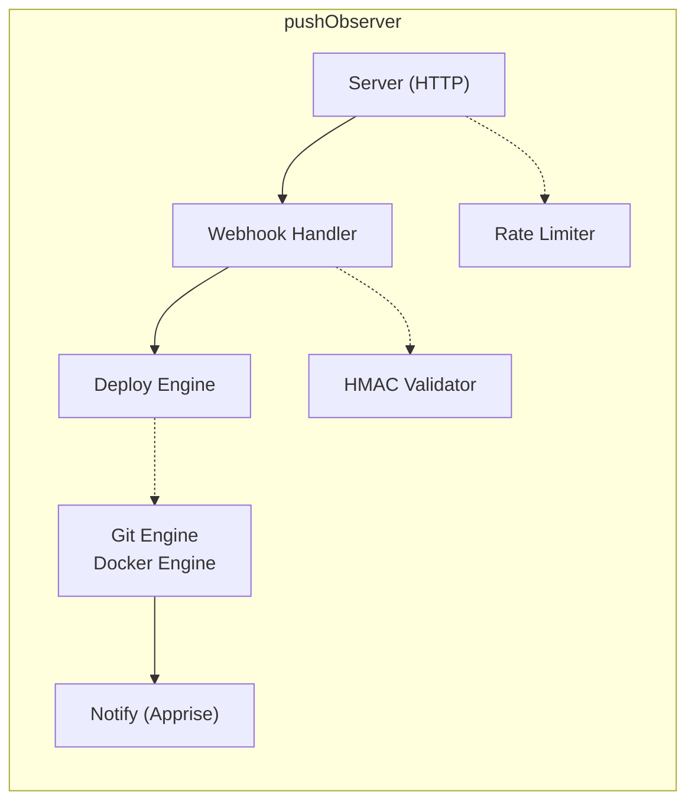

# pushObserver

**Push on git → deploy on server in 1 minute. Zero scripts.**

[](https://github.com/iHumberto/pushObserver/actions/workflows/ci.yaml)
[](https://github.com/iHumberto/pushObserver)
[](https://www.gnu.org/licenses/gpl-3.0)

🇧🇷 **Leia em português:** [README.pt-BR.md](README.pt-BR.md)

pushObserver is a webhook receiver that does one thing well: it watches your Git
repos and runs `docker compose up` when you push. No shell scripts, no YAML
pipelines, no Kubernetes — just a single Go binary that speaks Git and Docker.

If you run Docker Compose on a home server or VPS and want continuous deployment
without the complexity of GitOps, pushObserver is for you.

## How it works

```
git push → webhook POST → pushObserver → git pull → docker compose up → notified!
```

1. You `git push` to GitHub, Forgejo, Gitea, or GitLab
2. The platform sends a webhook POST to pushObserver's `/hook/:id`
3. pushObserver validates the HMAC signature (SHA256, SHA1, or token)
4. It pulls the repo and detects exactly which files changed
5. Runs `docker compose up -d --build` only for the services that changed
6. Sends you a notification via Apprise (Discord, Telegram, ntfy, ...)

### Architecture



The deploy engine is smart about restarts. Each service can use one of three
triggers:

| Trigger | Behaviour |
|---------|-----------|
| `always` | Always restart on every push |
| `default` | Restart if `.env`, `Dockerfile`, `docker-compose.yaml`, or `docker-compose.yml` changed inside the service folder |
| `on-change` | Same as `default` + any custom file extensions you define (`.py`, `.yaml`, `.json`, ...) |

## Stack

| Layer | Choice |
|-------|--------|
| Language | Go 1.23+ |
| HTTP | `net/http` (stdlib, Go 1.22+ routing) |
| Config | YAML with `${ENV_VAR}` substitution |
| Logging | `log/slog` (structured JSON or text) |
| Notifications | Apprise HTTP API (container separated) |
| Container | Alpine 3.21, multi-arch (amd64 + arm64) |
| License | GPL v3 |

The binary is static, under 15 MB, and has exactly one external dependency
(`gopkg.in/yaml.v3`). Everything else is Go standard library.

## First Run (Zero-Config)

pushObserver is designed to work out of the box with zero configuration:

1. **Start the container** — no config file needed
2. **Auto-generated config** — `push-observer.yaml` is created with safe defaults on first run
3. **Access the dashboard** — open `http://localhost:9090` and create your first hook via the WebUI
4. **No hooks?** — the dashboard shows "No hooks configured. Create your first hook." when empty

If you already have a `push-observer.yaml`, place it in the `./config/` directory before starting.

## Quick Start

### 1. Create your config file

Copy the default config and edit it:

```bash
curl -O https://raw.githubusercontent.com/humberto/push-observer/main/push-observer.yaml
```

### 2. Set up your first hook

Edit `push-observer.yaml` and uncomment the example hook section. Here is a minimal
working example for a public GitHub repo:

```yaml
server:
  port: 9090

hooks:
  - id: myapp
    repo_url: "https://github.com/you/your-docker-compose-repo.git"
    repo_dir: "/home/pi/docker"
    branch: "main"
    hmac:
      type: sha256
      secret: "${HMAC_SECRET_MYAPP}"
    services:
      - name: webserver
        path: "webserver"
        restart_trigger: default
```

### 3. Set your HMAC secret

```bash
export HMAC_SECRET_MYAPP="generate-a-random-string-here"
```

> **📘 HMAC:** A cryptographic signature that proves the webhook really came from
> your Git platform. Think of it as a wax seal on a letter — only someone with the
> same secret can produce a matching signature.

### 4. Start pushObserver

```bash
docker compose up -d
```

That is it. pushObserver is now listening on port 9090.

### 5. Configure the webhook on your Git platform

Take the URL of your pushObserver instance and add the hook to your platform:

- **GitHub**: Repo → Settings → Webhooks → Add webhook
  - Payload URL: `http://your-server:9090/hook/myapp`
  - Content type: `application/json`
  - Secret: same as `HMAC_SECRET_MYAPP`

- **Forgejo / Gitea**: Repo → Settings → Webhooks → Add Webhook
  - Target URL: `http://your-server:9090/hook/myapp`
  - HTTP Method: `POST`
  - Secret: same as `HMAC_SECRET_MYAPP`

- **GitLab**: Repo → Settings → Webhooks
  - URL: `http://your-server:9090/hook/myapp`
  - Trigger: Push events
  - Secret token: same as `HMAC_SECRET_MYAPP`
  - HMAC type in config: `token` (GitLab uses plain token comparison)

### 6. Push and watch it deploy

```bash
git add . && git commit -m "trigger deploy" && git push
```

Check the logs:

```bash
docker compose logs -f push-observer
```

## Deploy Keys (private repos)

If your repo is private, pushObserver needs SSH access. Use a **deploy key** — a
dedicated SSH key with read-only access to your repo.

### Generate a deploy key

On your server, generate an Ed25519 key **without a passphrase**:

```bash
ssh-keygen -t ed25519 -C "push-observer-deploy" -f ~/.ssh/push_observer_deploy_key
```

### Add the public key to your Git platform

The public key is in `~/.ssh/push_observer_deploy_key.pub`. Add it to your repo:

- **GitHub**: Repo → Settings → Deploy Keys → Add deploy key (check "Read-only")
- **Forgejo / Gitea**: Repo → Settings → Deploy Keys → Add Deploy Key
- **GitLab**: Repo → Settings → Repository → Deploy Keys

### Mount the key in the container

In your `docker-compose.yaml`, add a volume for the key:

```yaml
services:
  push-observer:
    volumes:
      - /home/pi/.ssh/push_observer_deploy_key:/home/webhook/.ssh/deploy_key:ro
```

### Reference the key in your config

```yaml
hooks:
  - id: myapp
    repo_url: "git@github.com:you/private-repo.git"
    git_ssh_key: "/home/webhook/.ssh/deploy_key"
```

pushObserver sets up `GIT_SSH_COMMAND` automatically to use this key. No
passphrase needed — the key is read-only and safe to mount.

## Webhook URL Reference

| Platform | HMAC type | HMAC header | Webhook URL example |
|----------|-----------|-------------|---------------------|
| GitHub | `sha256` | `X-Hub-Signature-256` | `http://pushobserver:9090/hook/myapp` |
| Forgejo | `sha256` | `X-Hub-Signature-256` | `http://pushobserver:9090/hook/myapp` |
| Gitea | `sha256` | `X-Hub-Signature-256` | `http://pushobserver:9090/hook/myapp` |
| GitLab | `token` | `X-Gitlab-Token` | `http://pushobserver:9090/hook/myapp` |

The URL pattern is always the same: `http://<host>:<port>/hook/<hook-id>`, where
`hook-id` matches the `id` field in your config.

## Notifications (optional)

pushObserver can notify you on deploy success or failure via
[Apprise](https://github.com/caronc/apprise) — a separate container that supports
100+ services (Discord, Telegram, ntfy, Slack, email, ...).

Add the Apprise service to your `docker-compose.yaml`:

```yaml
services:
  apprise:
    image: caronc/apprise:latest
    container_name: apprise
    restart: unless-stopped
    ports:
      - "8000:8000"
    volumes:
      - ./apprise:/config
```

Configure your notification services in `/config/apprise.yml` (see
[Apprise docs](https://github.com/caronc/apprise/wiki)). Then configure
pushObserver to use it:

```yaml
notifications:
  apprise_url: "http://apprise:8000"
  tag_success: "deploy-success"
  tag_failure: "deploy-failure"
```

Set per-hook notification preferences:

```yaml
hooks:
  - id: myapp
    notify:
      on_success: true
      on_failure: true
      on_no_changes: false   # skip "nothing changed" notifications
```

## Web Dashboard

pushObserver includes a built-in web dashboard at `http://your-server:9090/`.
From it you can:

- View all configured hooks and their last deploy status
- Create, edit, and delete hooks through the UI
- See which services are in each hook and their restart triggers
- Trigger manual deploys
- Scan repos for new services (subfolders with `docker-compose.yaml`)

The dashboard is server-rendered HTML with vanilla CSS — no JavaScript framework,
no build step, works on any browser.

An optional API key can protect the management endpoints. Set it in your config:

```yaml
api_key: "${PUSH_OBSERVER_API_KEY}"
```

Then pass the key as a header: `Authorization: Bearer <your-api-key>`.

## Configuration Reference

The full config lives in `push-observer.yaml`. Key sections:

| Section | What it controls |
|---------|-----------------|
| `server` | Port, host, timeouts |
| `api_key` | Optional password for the dashboard and management API |
| `hooks` | Your repos: one entry per repo you want to watch |
| `notifications` | Apprise URL and notification tags |
| `rate_limit` | Global rate limiting (requests per minute, burst) |
| `logging` | Log level, format (JSON or text), output |
| `environment` | Runtime behaviour via env vars (SERVER_TLS, PUSH_OBSERVER_API_KEY) |

Secrets use `${ENV_VAR}` syntax — never put passwords or tokens directly in the
YAML file.

### Environment Variables

pushObserver uses these environment variables for runtime configuration:

| Variable | Default | What it does |
|----------|---------|--------------|
| `SERVER_TLS` | `false` | When `true`, the CSRF cookie gets the `Secure` flag — required when pushObserver sits behind an HTTPS reverse proxy (nginx, Traefik, Caddy) |
| `PUSH_OBSERVER_CONFIG` | `push-observer.yaml` | Alternative path to the configuration file |
| `PUSH_OBSERVER_LOG_LEVEL` | `info` | Log level: `debug`, `info`, `warn`, `error` |
| `PUSH_OBSERVER_API_KEY` | (empty) | Optional password for the dashboard and management API endpoints |
| `HMAC_SECRET_*` | (empty) | Per-hook HMAC secrets — set via `${HMAC_SECRET_MYAPP}` in your config |

#### SERVER_TLS in detail

By default, pushObserver runs on HTTP (port 9090) with no TLS. This is perfect for
homelab deployments where the container is accessed directly or through a local
reverse proxy that handles HTTPS termination.

When you put pushObserver behind an HTTPS reverse proxy (e.g., `https://deploy.example.com`),
the CSRF cookie must carry the `Secure` flag so browsers only send it over HTTPS.
Set `SERVER_TLS=true` to enable this:

```yaml
# docker-compose.yaml
services:
  push-observer:
    environment:
      - SERVER_TLS=true
```

Or pass it through your `.env` file:

```bash
# .env
SERVER_TLS=true
```

```yaml
# docker-compose.yaml
services:
  push-observer:
    environment:
      - SERVER_TLS=${SERVER_TLS:-false}
```

> **📘 CSRF (Cross-Site Request Forgery):** A type of attack where a malicious site
> tricks your browser into performing actions on pushObserver. The CSRF cookie
> protects against this by requiring a matching token on every form submission.
> The `Secure` flag tells browsers to only send this cookie over encrypted HTTPS
> connections, preventing it from leaking on plain HTTP.

## Troubleshooting

### "git pull failed: permission denied (publickey)"

The SSH key is missing or not mounted correctly.

- Check the key exists in the container: `docker compose exec push-observer ls -la /home/webhook/.ssh/`
- Verify the volume is mounted in `docker-compose.yaml`
- Make sure you added the **public** key to your Git platform, not the private one

### "HMAC validation failed" (401 response)

The secret does not match between pushObserver and your Git platform.

- Check the HMAC type: GitHub/Forgejo/Gitea use `sha256`, GitLab uses `token`
- Verify the secret is the same on both sides
- Make sure the environment variable is set: `echo $HMAC_SECRET_MYAPP`

### "Hook not found" (404 response)

The `hook-id` in the URL does not match any `id` in your config.

- The URL path is `/hook/<id>` — check for typos
- Make sure the hook is not commented out in `push-observer.yaml`

### "docker compose: command not found"

The Docker socket is not mounted, or Docker Compose is not installed in the
container.

- Verify the volume: `- /var/run/docker.sock:/var/run/docker.sock`
- The official image includes `docker-cli` and `docker-compose` — make sure you
  are using `ghcr.io/humberto/push-observer:latest`, not building locally

### Deploy is slow or times out

The default deploy timeout is 300 seconds. If your `docker compose up` takes
longer (large images, slow network), increase it:

```yaml
hooks:
  - id: myapp
    deploy:
      timeout: 600s
```

You can also increase the server's write timeout:

```yaml
server:
  write_timeout: 600s
```

### Notifications are not being sent

- Check that the Apprise container is running: `docker compose ps apprise`
- Verify the `apprise_url` in your config points to the right container
- Check pushObserver logs for notification errors: `docker compose logs push-observer | grep notify`

## Requirements

- Docker and Docker Compose
- A Git repo (public or private) containing one or more `docker-compose.yaml`
  files in subfolders
- (Optional) Apprise container for notifications
- (Optional) SSH deploy key for private repos

Works on any Linux host — tested on Raspberry Pi 4B (arm64) and x86_64.

## License

GNU General Public License v3.0. See [LICENSE](LICENSE).

Copyright (C) 2026 Humberto Faria.
