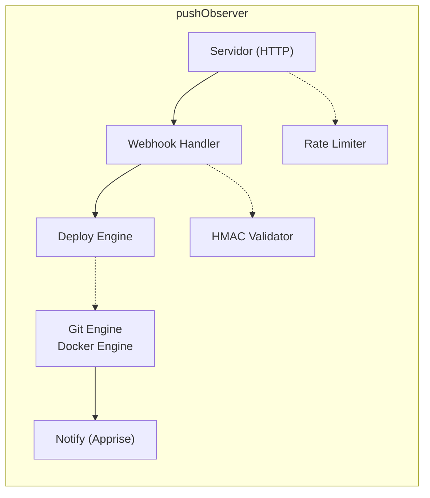

#  pushObserver

**Faça push no git → deploy no servidor em 1 minuto. Zero scripts.**

[](https://github.com/iHumberto/pushObserver/actions/workflows/ci.yaml)
[](https://github.com/iHumberto/pushObserver)
[](https://www.gnu.org/licenses/gpl-3.0)

🇺🇸 **Read in English:** [README.md](README.md)

O pushObserver é um receptor de webhooks que faz uma coisa bem feita: ele observa seus
repositórios Git e executa `docker compose up` quando você faz push. Zero scripts
shell, zero pipelines YAML, zero Kubernetes — apenas um binário Go que fala Git e
Docker.

Se você usa Docker Compose em um servidor doméstico ou VPS e quer deploy contínuo
sem a complexidade do GitOps, o pushObserver é para você.

## Como funciona

```
git push → webhook POST → pushObserver → git pull → docker compose up → notificado!
```

1. Você faz `git push` para GitHub, Forgejo, Gitea ou GitLab
2. A plataforma envia um webhook POST para `/hook/:id` do pushObserver
3. O pushObserver valida a assinatura HMAC (SHA256, SHA1 ou token)
4. Ele faz pull do repositório e detecta exatamente quais arquivos mudaram
5. Executa `docker compose up -d --build` apenas para os serviços que mudaram
6. Envia uma notificação via Apprise (Discord, Telegram, ntfy, ...)

### Arquitetura



O deploy engine é inteligente sobre reinicializações. Cada serviço pode usar um
dos três gatilhos:

| Gatilho | Comportamento |
|---------|---------------|
| `always` | Sempre reinicia a cada push |
| `default` | Reinicia se `.env`, `Dockerfile`, `docker-compose.yaml` ou `docker-compose.yml` mudaram dentro da pasta do serviço |
| `on-change` | Igual ao `default` + extensões de arquivo customizadas que você definir (`.py`, `.yaml`, `.json`, ...) |

## Stack

| Camada | Escolha |
|--------|---------|
| Linguagem | Go 1.23+ |
| HTTP | `net/http` (stdlib, roteamento do Go 1.22+) |
| Configuração | YAML com substituição de `${ENV_VAR}` |
| Logging | `log/slog` (JSON estruturado ou texto) |
| Notificações | Apprise HTTP API (container separado) |
| Container | Alpine 3.21, multi-arch (amd64 + arm64) |
| Licença | GPL v3 |

O binário é estático, tem menos de 15 MB e possui exatamente uma dependência
externa (`gopkg.in/yaml.v3`). Todo o resto é biblioteca padrão do Go.

## Primeira execução (Zero configuração)

O pushObserver foi projetado para funcionar sem nenhuma configuração:

1. **Inicie o container** — nenhum arquivo de configuração necessário
2. **Configuração auto-gerada** — `push-observer.yaml` é criado com padrões seguros na primeira execução
3. **Acesse o dashboard** — abra `http://localhost:9090` e crie seu primeiro hook pela interface Web
4. **Sem hooks?** — o dashboard mostra "Nenhum hook configurado. Crie seu primeiro hook." quando vazio

Se você já tem um `push-observer.yaml`, coloque-o no diretório `./config/` antes de iniciar.

## Guia rápido

### 1. Crie seu arquivo de configuração

Copie a configuração padrão e edite-a:

```bash
curl -O https://raw.githubusercontent.com/humberto/push-observer/main/push-observer.yaml
```

### 2. Configure seu primeiro hook

Edite `push-observer.yaml` e descomente a seção de exemplo de hook. Aqui está um
exemplo mínimo funcional para um repositório público do GitHub:

```yaml
server:
  port: 9090

hooks:
  - id: myapp
    repo_url: "https://github.com/voce/seu-repo-docker-compose.git"
    repo_dir: "/home/pi/docker"
    branch: "main"
    hmac:
      type: sha256
      secret: "${HMAC_SECRET_MYAPP}"
    services:
      - name: webserver
        path: "webserver"
        restart_trigger: default
```

### 3. Defina seu segredo HMAC

```bash
export HMAC_SECRET_MYAPP="gere-uma-string-aleatoria-aqui"
```

> **📘 HMAC:** Uma assinatura criptográfica que prova que o webhook realmente veio
> da sua plataforma Git. Pense nela como um selo de cera em uma carta — apenas
> alguém com o mesmo segredo pode produzir uma assinatura correspondente.

### 4. Inicie o pushObserver

```bash
docker compose up -d
```

Pronto. O pushObserver agora está escutando na porta 9090.

### 5. Configure o webhook na sua plataforma Git

Pegue a URL da sua instância do pushObserver e adicione o hook na sua plataforma:

- **Forgejo / Gitea**: Repo → Settings → Webhooks → Add Webhook
  - Target URL: `http://seu-servidor:9090/hook/myapp`
  - HTTP Method: `POST`
  - Secret: mesmo valor de `HMAC_SECRET_MYAPP`

- **GitLab** (self-hosted): Repo → Settings → Webhooks
  - URL: `http://seu-servidor:9090/hook/myapp`
  - Trigger: Push events
  - Secret token: mesmo valor de `HMAC_SECRET_MYAPP`
  - Tipo HMAC na config: `token` (GitLab usa comparação de token simples)

- **GitHub / GitLab.com**: Estas plataformas exigem uma **URL pública com HTTPS**. Você tem duas opções:
  - Use um proxy reverso com domínio (nginx + Let's Encrypt, Caddy, Traefik)
  - Use um túnel: `ngrok http 9090`, depois use a URL `https://xxxx.ngrok.io/hook/myapp`
  - Content type: `application/json`
  - Secret: mesmo valor de `HMAC_SECRET_MYAPP`

### 6. Faça push e veja o deploy

```bash
git add . && git commit -m "dispara deploy" && git push
```

Verifique os logs:

```bash
docker compose logs -f push-observer
```

## Deploy Keys (repositórios privados)

Se seu repositório for privado, o pushObserver precisa de acesso SSH. Use uma
**deploy key** — uma chave SSH dedicada com acesso somente leitura ao seu
repositório.

### Gere uma deploy key

No seu servidor, gere uma chave Ed25519 **sem frase secreta**:

```bash
ssh-keygen -t ed25519 -C "push-observer-deploy" -f ~/.ssh/push_observer_deploy_key
```

### Adicione a chave pública na sua plataforma Git

A chave pública está em `~/.ssh/push_observer_deploy_key.pub`. Adicione-a ao seu repositório:

- **GitHub**: Repo → Settings → Deploy Keys → Add deploy key (marque "Read-only")
- **Forgejo / Gitea**: Repo → Settings → Deploy Keys → Add Deploy Key
- **GitLab**: Repo → Settings → Repository → Deploy Keys

### Monte a chave no container

No seu `docker-compose.yaml`, adicione um volume para a chave:

```yaml
services:
  push-observer:
    volumes:
      - /home/pi/.ssh/push_observer_deploy_key:/home/webhook/.ssh/deploy_key:ro
```

### Referencie a chave na sua configuração

```yaml
hooks:
  - id: myapp
    repo_url: "git@github.com:voce/repo-privado.git"
    git_ssh_key: "/home/webhook/.ssh/deploy_key"
```

O pushObserver configura `GIT_SSH_COMMAND` automaticamente para usar esta chave.
Nenhuma frase secreta necessária — a chave é somente leitura e segura para montar.

## Referência de URLs de Webhook

| Plataforma | Tipo HMAC | Cabeçalho HMAC | Exemplo de URL de webhook |
|------------|-----------|----------------|---------------------------|
| GitHub | `sha256` | `X-Hub-Signature-256` | `http://pushobserver:9090/hook/myapp` |
| Forgejo | `sha256` | `X-Hub-Signature-256` | `http://pushobserver:9090/hook/myapp` |
| Gitea | `sha256` | `X-Hub-Signature-256` | `http://pushobserver:9090/hook/myapp` |
| GitLab | `token` | `X-Gitlab-Token` | `http://pushobserver:9090/hook/myapp` |

O padrão da URL é sempre o mesmo: `http://<host>:<porta>/hook/<hook-id>`, onde
`hook-id` corresponde ao campo `id` na sua configuração.

## Notificações (opcional)

O pushObserver pode notificar você sobre sucesso ou falha no deploy via
[Apprise](https://github.com/caronc/apprise) — um container separado que suporta
mais de 100 serviços (Discord, Telegram, ntfy, Slack, email, ...).

Adicione o serviço Apprise ao seu `docker-compose.yaml`:

```yaml
services:
  apprise:
    image: caronc/apprise:latest
    container_name: apprise
    restart: unless-stopped
    ports:
      - "8000:8000"
    volumes:
      - ./apprise:/config
```

Configure seus serviços de notificação em `/config/apprise.yml` (veja a
[documentação do Apprise](https://github.com/caronc/apprise/wiki)). Depois
configure o pushObserver para usá-lo:

```yaml
notifications:
  apprise_url: "http://apprise:8000"
  tag_success: "deploy-success"
  tag_failure: "deploy-failure"
```

Defina as preferências de notificação por hook:

```yaml
hooks:
  - id: myapp
    notify:
      on_success: true
      on_failure: true
      on_no_changes: false   # pula notificações de "nenhuma mudança"
```

### Configurando pela WebUI

Você também pode configurar as notificações diretamente pelo dashboard — sem
precisar editar o YAML manualmente.

#### Configurações globais de notificação

No dashboard principal, encontre o card **🔔 Notificações** acima da lista de hooks:

1. **Apprise URL** — digite o endereço do seu container Apprise (por exemplo:
   `http://apprise:8000`). Deixe vazio para desabilitar totalmente as notificações.
2. **Tag — Sucesso** — a tag para deploys bem-sucedidos (por exemplo:
   `deploy-success`)
3. **Tag — Falha** — a tag para deploys com falha (por exemplo:
   `deploy-failure`)
4. **Tag — Sem mudanças** — a tag para quando nada mudou (opcional — deixe vazio
   para silenciar estas notificações)

Clique em **Salvar configurações de notificação** para aplicar.

> **📘 Tags:** As tags permitem direcionar notificações para serviços diferentes
> no Apprise. Por exemplo, envie notificações de sucesso para o Telegram e
> alertas de falha para o Discord atribuindo tags diferentes a cada serviço na
> sua configuração do Apprise.

#### Preferências de notificação por hook

Ao criar ou editar um hook, procure abaixo dos campos HMAC. Você verá três
checkboxes:

- **No sucesso** — notifica quando o deploy é bem-sucedido
- **Na falha** — notifica quando o deploy falha
- **Sem mudanças** — notifica quando nenhuma mudança é detectada

Marque ou desmarque conforme necessário e salve o hook. Cada hook mantém suas
próprias preferências de notificação.

> **💡 Entrega sob melhor esforço:** As notificações são enviadas em regime de
> melhor esforço. Se o envio falhar (por exemplo, o Apprise estiver
> temporariamente fora do ar), o erro é registrado no log, mas seu deploy é
> concluído normalmente.

## Dashboard Web

O pushObserver inclui um dashboard web integrado em `http://seu-servidor:9090/`.
Nele você pode:

- Ver todos os hooks configurados e o status do último deploy
- Criar, editar e excluir hooks pela interface
- Ver quais serviços estão em cada hook e seus gatilhos de reinicialização
- Disparar deploys manuais
- Escanear repositórios por novos serviços (subpastas com `docker-compose.yaml`)

O dashboard é HTML renderizado no servidor com CSS puro — sem framework
JavaScript, sem etapa de build, funciona em qualquer navegador.

Uma chave de API opcional pode proteger os endpoints de gerenciamento. Defina-a
na sua configuração:

```yaml
api_key: "${PUSH_OBSERVER_API_KEY}"
```

Em seguida, passe a chave como cabeçalho: `Authorization: Bearer <sua-chave-api>`

## 🌐 Idioma

O dashboard fala sua língua. O seletor de idioma fica na barra de navegação
do cabeçalho, ao lado dos links **Hooks** e **+ Novo**:

| Seletor | O que faz |
|---------|-----------|
| 🇧🇷 pt-BR | Português (padrão) — o dashboard carrega em português na primeira visita |
| 🇺🇸 en-US | Inglês — alterne a qualquer momento para uma interface em inglês |

Sua escolha é salva automaticamente — o dashboard lembra sua preferência mesmo
depois que você fecha o navegador. Funciona em todas as páginas: a lista de
hooks, o formulário de criação/edição e a visão detalhada do hook com serviços.

Nenhuma configuração necessária. O seletor de idioma funciona em qualquer
navegador moderno.

## Referência de configuração

A configuração completa fica em `push-observer.yaml`. Seções principais:

| Seção | O que controla |
|-------|----------------|
| `server` | Porta, host, timeouts |
| `api_key` | Senha opcional para o dashboard e API de gerenciamento |
| `hooks` | Seus repositórios: uma entrada por repositório que você quer observar |
| `notifications` | URL do Apprise e tags de notificação |
| `rate_limit` | Limitação de taxa global (requisições por minuto, burst) |
| `logging` | Nível de log, formato (JSON ou texto), saída |
| `environment` | Comportamento em tempo de execução via variáveis de ambiente (SERVER_TLS, PUSH_OBSERVER_API_KEY) |

Segredos usam sintaxe `${ENV_VAR}` — nunca coloque senhas ou tokens diretamente
no arquivo YAML.

### Variáveis de ambiente

O pushObserver usa estas variáveis de ambiente para configuração em tempo de
execução:

| Variável | Padrão | O que faz |
|----------|--------|-----------|
| `SERVER_TLS` | `false` | Quando `true`, o cookie CSRF recebe a flag `Secure` — necessário quando o pushObserver fica atrás de um proxy reverso HTTPS (nginx, Traefik, Caddy) |
| `PUSH_OBSERVER_CONFIG` | `push-observer.yaml` | Caminho alternativo para o arquivo de configuração |
| `PUSH_OBSERVER_LOG_LEVEL` | `info` | Nível de log: `debug`, `info`, `warn`, `error` |
| `PUSH_OBSERVER_API_KEY` | (vazio) | Senha opcional para o dashboard e endpoints da API de gerenciamento |
| `HMAC_SECRET_*` | (vazio) | Segredos HMAC por hook — defina via `${HMAC_SECRET_MYAPP}` na sua configuração |

#### SERVER_TLS em detalhes

Por padrão, o pushObserver roda em HTTP (porta 9090) sem TLS. Isso é ideal para
implantações em homelab onde o container é acessado diretamente ou através de um
proxy reverso local que faz a terminação HTTPS.

Quando você coloca o pushObserver atrás de um proxy reverso HTTPS (ex:
`https://deploy.exemplo.com`), o cookie CSRF deve carregar a flag `Secure` para
que os navegadores só o enviem por HTTPS. Defina `SERVER_TLS=true` para ativar
isso:

```yaml
# docker-compose.yaml
services:
  push-observer:
    environment:
      - SERVER_TLS=true
```

Ou passe pela seu arquivo `.env`:

```bash
# .env
SERVER_TLS=true
```

```yaml
# docker-compose.yaml
services:
  push-observer:
    environment:
      - SERVER_TLS=${SERVER_TLS:-false}
```

> **📘 CSRF (Cross-Site Request Forgery):** Um tipo de ataque onde um site
> malicioso engana seu navegador para realizar ações no pushObserver. O cookie
> CSRF protege contra isso exigindo um token correspondente em cada envio de
> formulário. A flag `Secure` instrui os navegadores a enviarem este cookie apenas
> por conexões HTTPS criptografadas, evitando que ele vaze em HTTP simples.

## Solução de problemas

### "git pull failed: permission denied (publickey)"

A chave SSH está ausente ou não foi montada corretamente.

- Verifique se a chave existe no container: `docker compose exec push-observer ls -la /home/webhook/.ssh/`
- Verifique se o volume está montado no `docker-compose.yaml`
- Certifique-se de que você adicionou a chave **pública** na sua plataforma Git, não a privada

### "HMAC validation failed" (resposta 401)

O segredo não coincide entre o pushObserver e sua plataforma Git.

- Verifique o tipo HMAC: GitHub/Forgejo/Gitea usam `sha256`, GitLab usa `token`
- Verifique se o segredo é o mesmo em ambos os lados
- Certifique-se de que a variável de ambiente está definida: `echo $HMAC_SECRET_MYAPP`

### "Hook not found" (resposta 404)

O `hook-id` na URL não corresponde a nenhum `id` na sua configuração.

- O caminho da URL é `/hook/<id>` — verifique se há erros de digitação
- Certifique-se de que o hook não está comentado em `push-observer.yaml`

### "docker compose: command not found"

O socket do Docker não está montado ou o Docker Compose não está instalado no
container.

- Verifique o volume: `- /var/run/docker.sock:/var/run/docker.sock`
- A imagem oficial inclui `docker-cli` e `docker-compose` — certifique-se de que
  você está usando `ghcr.io/humberto/push-observer:latest`, não compilando localmente

### O deploy está lento ou atinge timeout

O timeout padrão de deploy é de 300 segundos. Se seu `docker compose up` demora
mais (imagens grandes, rede lenta), aumente-o:

```yaml
hooks:
  - id: myapp
    deploy:
      timeout: 600s
```

Você também pode aumentar o timeout de escrita do servidor:

```yaml
server:
  write_timeout: 600s
```

### As notificações não estão sendo enviadas

- Verifique se o container Apprise está rodando: `docker compose ps apprise`
- Verifique se o `apprise_url` na sua configuração aponta para o container correto
- Verifique os logs do pushObserver para erros de notificação: `docker compose logs push-observer | grep notify`

## Requisitos

- Docker e Docker Compose
- Um repositório Git (público ou privado) contendo um ou mais arquivos
  `docker-compose.yaml` em subpastas
- (Opcional) Container Apprise para notificações
- (Opcional) Chave SSH de deploy para repositórios privados

Funciona em qualquer host Linux — testado no Raspberry Pi 4B (arm64) e x86_64.

## Licença

GNU General Public License v3.0. Veja [LICENSE](LICENSE).

Copyright (C) 2026 Humberto Faria.
